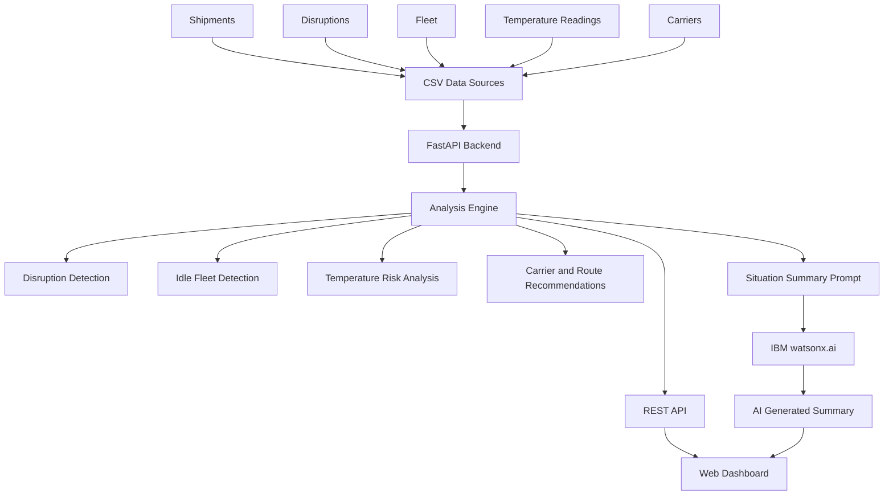

# Architecture

## System Architecture

The prototype follows a simple layered architecture. Local CSV files provide the operational data, the FastAPI backend performs deterministic analysis and recommendations, and the web frontend presents the results.

IBM watsonx.ai is an optional AI layer used specifically for generating a concise situation summary.

## Components

| Component       | Technology                | Responsibility                                                                                                |
| --------------- | ------------------------- | ------------------------------------------------------------------------------------------------------------- |
| Frontend        | HTML, CSS, JavaScript     | Displays operational metrics, affected shipments, fleet availability, temperature risks, and recommendations. |
| Backend API     | FastAPI                   | Provides REST endpoints and coordinates the analysis functions.                                               |
| Analysis Engine | Python, Pandas            | Detects disruptions, matches fleet, identifies temperature excursions, and generates recommendations.         |
| Data Sources    | CSV files                 | Stores prototype shipment, disruption, fleet, carrier, and temperature data.                                  |
| AI Layer        | IBM watsonx.ai            | Generates an optional natural-language situation summary using the current operational information.           |
| AI SDK          | IBM watsonx.ai Python SDK | Connects the backend to the watsonx.ai inference service.                                                     |
| Testing         | Python `unittest`         | Verifies analysis logic, recommendations, temperature handling, and data integrity.                           |

## Data Flow

1. Operational data is loaded from the CSV files in `src/data/`.

2. The backend loads shipments, disruptions, fleet, carrier, and temperature information using Pandas.

3. Active disruptions are compared with shipment origins and destinations to identify affected shipments.

4. Available fleet is filtered according to vehicle availability, cargo capacity, location, and cold-chain requirements.

5. Temperature readings above 8°C are identified as cold-chain excursions and assigned a risk severity.

6. The recommendation engine evaluates alternative carriers, available vehicles, and practical routes.

7. The FastAPI backend exposes the analysis results through REST endpoints.

8. The frontend requests the data and displays the results in the dashboard.

9. For the situation summary, the backend creates a factual prompt from the current analysis.

10. When watsonx.ai credentials are configured, the prompt is sent to the IBM watsonx.ai model and the generated summary is returned to the dashboard.

11. If watsonx.ai is unavailable, the application uses a clear fallback message while the rest of the dashboard continues to function.

## Security Considerations

* IBM watsonx.ai credentials are stored in environment variables and are not hard-coded in source files.
* `.env` files containing credentials must not be committed to Git.
* `src/.env.example` documents the expected environment variables without containing real secrets.
* The application currently runs locally and does not implement user authentication.
* The prototype does not store sensitive personal information.
* Production deployment would require authentication, HTTPS, secret management, access control, and additional API security.

## Scalability Notes

The current prototype is intentionally simple and uses CSV files so that it can be reproduced easily during the hackathon.

For a production deployment:

* CSV files could be replaced by a managed relational database or logistics data platform.
* The FastAPI backend could be deployed as stateless application instances behind a load balancer.
* Shipment, fleet, and temperature data could be updated through live APIs or event streams.
* Background workers could process large numbers of temperature readings and disruption events.
* Caching could reduce repeated analysis of unchanged operational data.
* watsonx.ai requests could be queued and rate-limited to handle higher demand.
* Authentication and role-based access control could be added for different logistics users.
* Live GPS, traffic, port, and carrier data could improve the accuracy of routing recommendations.
